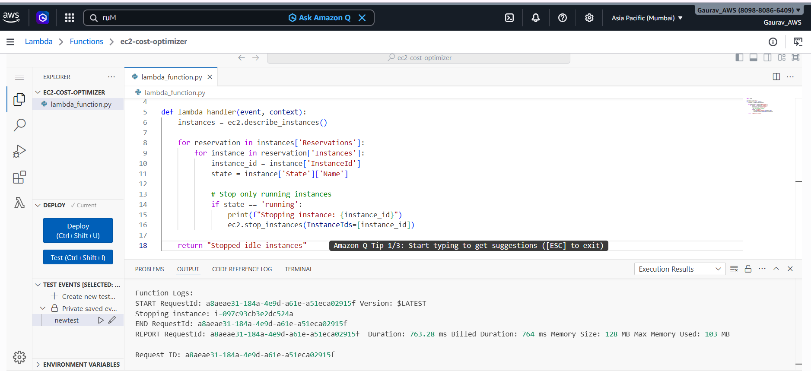
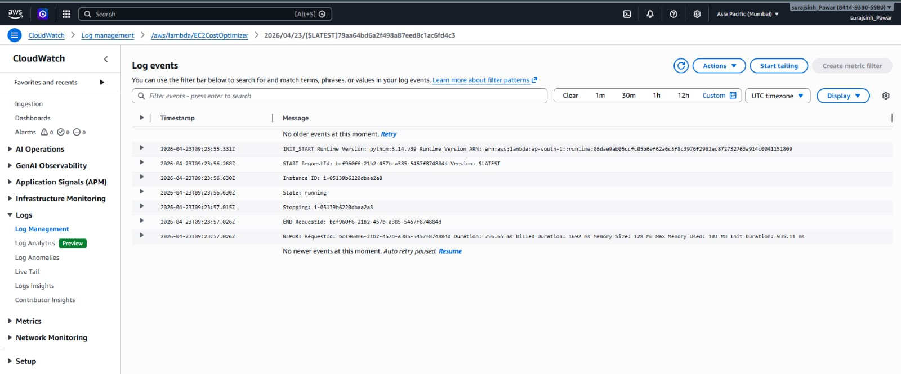

# 🚀 AWS Automated Cost Optimizer

## 📌 Overview

This project automates AWS cost optimization by stopping unused EC2 instances using AWS Lambda and CloudWatch/EventBridge scheduling.

The solution helps reduce unnecessary AWS billing by automatically managing idle compute resources without manual intervention.

---

# 🧰 AWS Services Used

* AWS Lambda
* Amazon EC2
* Amazon EventBridge (CloudWatch Rules)
* AWS IAM

---

# 🏗️ Architecture

```text
EventBridge Scheduler
        ↓
   AWS Lambda
        ↓
   Amazon EC2
(Stop Running Instances)
```

---

# ⚙️ Project Workflow

1. EventBridge triggers the Lambda function on a schedule.
2. Lambda checks all EC2 instances.
3. Running instances are automatically stopped.
4. AWS cost is reduced by avoiding idle compute usage.

---

# 💻 Lambda Function Code

```python
import boto3

ec2 = boto3.client('ec2')

def lambda_handler(event, context):
    instances = ec2.describe_instances()

    for reservation in instances['Reservations']:
        for instance in reservation['Instances']:

            instance_id = instance['InstanceId']
            state = instance['State']['Name']

            if state == 'running':
                print(f"Stopping instance: {instance_id}")

                ec2.stop_instances(
                    InstanceIds=[instance_id]
                )

    return {
        'statusCode': 200,
        'body': 'EC2 instances stopped successfully'
    }
```

---

# ⚙️ Setup Steps

## 1️⃣ Create IAM Role

* Create IAM role for Lambda
* Attach:

  * `AmazonEC2FullAccess`

---

## 2️⃣ Create Lambda Function

* Runtime: Python 3.x
* Upload Lambda code

---

## 3️⃣ Create EventBridge Rule

* Schedule expression:

```text
rate(1 hour)
```

* Target:

  * Lambda function

---

## 4️⃣ Test

* Start EC2 instance
* Trigger Lambda manually or wait for scheduler
* Verify instance automatically stops

---

# 📸 Screenshots

## 🔹 Lambda Function


---

## 🔹 EventBridge Rule


---

## 🔹 EC2 Instance Running



---

## 🔹 EC2 Automatically Stopped



---

# 📊 Results

✅ Automated EC2 cost optimization
✅ Reduced unnecessary AWS billing
✅ Event-driven serverless automation
✅ No manual intervention required

---

# 💡 Key Learnings

* AWS Lambda automation
* Event-driven architecture
* EC2 lifecycle management
* AWS IAM permissions
* CloudWatch/EventBridge scheduling

---

# 🚀 Future Improvements

* Stop only idle EC2 instances using CPU metrics
* Add CloudWatch monitoring
* Send SNS email alerts before shutdown
* Add tag-based filtering
* Integrate Cost Explorer APIs

---

# 📂 Project Structure

```text
aws-cost-optimizer/
│── lambda_function.py
│── README.md
│── screenshots/
```

---

# 🔗 GitHub Commands

```bash
git add .
git commit -m "Added AWS Cost Optimizer project"
git push
```

---

# 🎯 Interview Summary

> Built an automated AWS cost optimization solution using Lambda and EventBridge to stop unused EC2 instances automatically, reducing cloud infrastructure costs through serverless automation.

---
# 🚀 AWS Automated Cost Optimizer

## 📌 Overview

This project automates AWS cost optimization by stopping unused EC2 instances using AWS Lambda and CloudWatch/EventBridge scheduling.

The solution helps reduce unnecessary AWS billing by automatically managing idle compute resources without manual intervention.

---

# 🧰 AWS Services Used

* AWS Lambda
* Amazon EC2
* Amazon EventBridge (CloudWatch Rules)
* AWS IAM

---

# 🏗️ Architecture

```text
EventBridge Scheduler
        ↓
   AWS Lambda
        ↓
   Amazon EC2
(Stop Running Instances)
```

---

# ⚙️ Project Workflow

1. EventBridge triggers the Lambda function on a schedule.
2. Lambda checks all EC2 instances.
3. Running instances are automatically stopped.
4. AWS cost is reduced by avoiding idle compute usage.

---

# 💻 Lambda Function Code

```python
import boto3

ec2 = boto3.client('ec2')

def lambda_handler(event, context):
    instances = ec2.describe_instances()

    for reservation in instances['Reservations']:
        for instance in reservation['Instances']:

            instance_id = instance['InstanceId']
            state = instance['State']['Name']

            if state == 'running':
                print(f"Stopping instance: {instance_id}")

                ec2.stop_instances(
                    InstanceIds=[instance_id]
                )

    return {
        'statusCode': 200,
        'body': 'EC2 instances stopped successfully'
    }
```

---

# ⚙️ Setup Steps

## 1️⃣ Create IAM Role

* Create IAM role for Lambda
* Attach:

  * `AmazonEC2FullAccess`

---

## 2️⃣ Create Lambda Function

* Runtime: Python 3.x
* Upload Lambda code

---

## 3️⃣ Create EventBridge Rule

* Schedule expression:

```text
rate(1 hour)
```

* Target:

  * Lambda function

---

## 4️⃣ Test

* Start EC2 instance
* Trigger Lambda manually or wait for scheduler
* Verify instance automatically stops

---

# 📸 Screenshots

## 🔹 Lambda Function


---

## 🔹 EventBridge Rule


---

## 🔹 EC2 Instance Running


---

## 🔹 EC2 Automatically Stopped


---

# 📊 Results

✅ Automated EC2 cost optimization
✅ Reduced unnecessary AWS billing
✅ Event-driven serverless automation
✅ No manual intervention required

---

# 💡 Key Learnings

* AWS Lambda automation
* Event-driven architecture
* EC2 lifecycle management
* AWS IAM permissions
* CloudWatch/EventBridge scheduling

---

# 🚀 Future Improvements

* Stop only idle EC2 instances using CPU metrics
* Add CloudWatch monitoring
* Send SNS email alerts before shutdown
* Add tag-based filtering
* Integrate Cost Explorer APIs

---

# 📂 Project Structure

```text
aws-cost-optimizer/
│── lambda_function.py
│── README.md
│── screenshots/
```

---

# 🔗 GitHub Commands

```bash
git add .
git commit -m "Added AWS Cost Optimizer project"
git push
```

---

# 🎯 Interview Summary

> Built an automated AWS cost optimization solution using Lambda and EventBridge to stop unused EC2 instances automatically, reducing cloud infrastructure costs through serverless automation.

---
